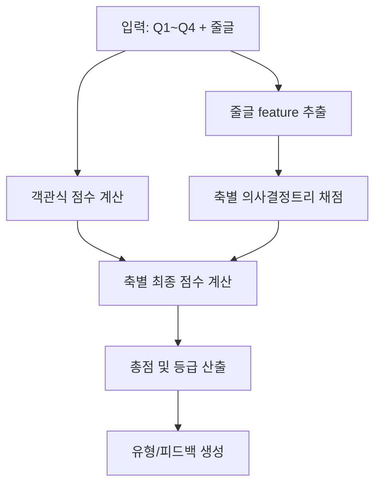
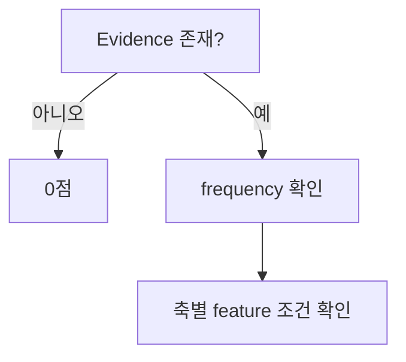
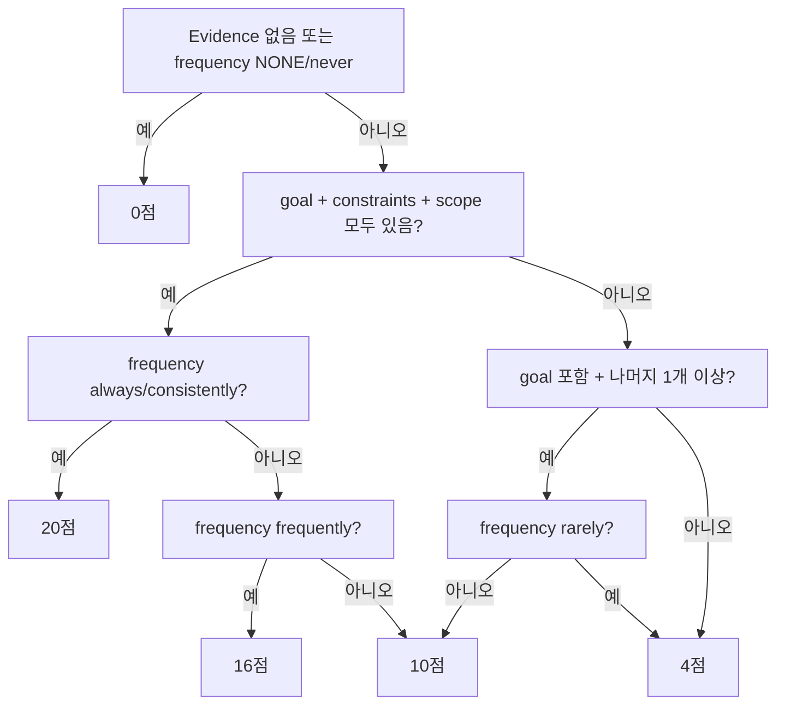

# Track 2 의사결정트리 기반 채점 모델

## 목표

기존 `track2_backend_system_prompt_v2.md`의 긴 루브릭을 백엔드 계산 로직과 짧은 LLM 판별 로직으로 분리한다.

- 객관식 점수: LLM이 아니라 코드에서 고정 테이블로 계산
- 줄글 점수: LLM은 6개 축별 Evidence, 빈도 부사, 행동 feature만 추출
- 최종 점수: 의사결정트리 규칙으로 결정
- 피드백: 계산 결과와 상하위 축을 입력해 짧게 생성

이 구조의 목적은 채점 에이전트가 매 요청마다 긴 표와 설명을 읽지 않게 만드는 것이다.

---

## 1. 입력

```json
{
  "answers": {
    "Q1": "D",
    "Q2": "D",
    "Q3": "B",
    "Q4": "C"
  },
  "freeText": "사용자가 붙여넣은 줄글"
}
```

---

## 2. 전체 파이프라인



---

## 3. 객관식 채점 모델

객관식은 의사결정 대상이 아니라 deterministic scoring이다. 아래 매핑을 코드 상수로 둔다.

### 3.1 축 정보

```json
{
  "task_clarity": { "label": "작업 명확성", "max": 20, "mcMax": 67, "textMax": 20 },
  "context": { "label": "배경·맥락", "max": 20, "mcMax": 52, "textMax": 20 },
  "role": { "label": "역할 지정", "max": 15, "mcMax": 45, "textMax": 15 },
  "output_format": { "label": "출력 형식", "max": 15, "mcMax": 30, "textMax": 15 },
  "iteration": { "label": "반복 개선", "max": 15, "mcMax": 45, "textMax": 15 },
  "critical_review": { "label": "비판적 검토", "max": 15, "mcMax": 45, "textMax": 15 }
}
```

### 3.2 선택지 점수표

배열 순서:

`[task_clarity, context, role, output_format, iteration, critical_review]`

```json
{
  "Q1": {
    "A": [0, 0, 0, 0, 5, 0],
    "B": [0, 12, 0, 0, 12, 0],
    "C": [0, 0, 0, 0, 15, 15],
    "D": [20, 0, 0, 15, 0, 15],
    "E": [0, 0, 0, 0, 0, 9]
  },
  "Q2": {
    "A": [5, 0, 0, 0, 0, 0],
    "B": [12, 0, 0, 9, 0, 0],
    "C": [0, 0, 0, 12, 15, 0],
    "D": [20, 0, 15, 15, 0, 0],
    "E": [3, 0, 0, 0, 0, 0]
  },
  "Q3": {
    "A": [5, 0, 0, 0, 0, 0],
    "B": [12, 20, 0, 0, 0, 0],
    "C": [12, 0, 0, 0, 15, 0],
    "D": [15, 20, 15, 0, 15, 15],
    "E": [0, 0, 0, 0, 0, 12]
  },
  "Q4": {
    "A": [0, 3, 0, 0, 0, 0],
    "B": [0, 12, 0, 0, 0, 0],
    "C": [12, 12, 0, 0, 0, 0],
    "D": [15, 20, 15, 0, 0, 15],
    "E": [0, 0, 0, 0, 0, 12]
  }
}
```

### 3.3 객관식 정규화

```text
mcNormalized(axis) = mcRaw(axis) / mcMax(axis) * axisMax(axis)
```

---

## 4. 줄글 Feature 추출

LLM은 점수를 직접 계산하지 않고 아래 JSON만 반환한다.

```json
{
  "task_clarity": {
    "evidence": "원문 구절 또는 NONE",
    "frequency": "always|consistently|frequently|sometimes|occasionally|rarely|never|NONE",
    "features": {
      "has_goal": true,
      "has_constraints": true,
      "has_scope": true
    }
  },
  "context": {
    "evidence": "원문 구절 또는 NONE",
    "frequency": "always|consistently|frequently|sometimes|occasionally|rarely|never|NONE",
    "features": {
      "has_purpose": true,
      "has_background": true,
      "has_audience": true
    }
  },
  "role": {
    "evidence": "원문 구절 또는 NONE",
    "frequency": "always|consistently|frequently|sometimes|occasionally|rarely|never|NONE",
    "features": {
      "has_role": true,
      "has_specific_title": true,
      "has_domain_expertise": true
    }
  },
  "output_format": {
    "evidence": "원문 구절 또는 NONE",
    "frequency": "always|consistently|frequently|sometimes|occasionally|rarely|never|NONE",
    "features": {
      "has_format": true,
      "has_length": true,
      "has_tone": true
    }
  },
  "iteration": {
    "evidence": "원문 구절 또는 NONE",
    "frequency": "always|consistently|frequently|sometimes|occasionally|rarely|never|NONE",
    "features": {
      "identifies_problem": true,
      "explains_reason": true,
      "asks_revision": true
    }
  },
  "critical_review": {
    "evidence": "원문 구절 또는 NONE",
    "frequency": "always|consistently|frequently|sometimes|occasionally|rarely|never|NONE",
    "features": {
      "challenges_answer": true,
      "rejects_unfit_answer": true,
      "requests_correction": true
    }
  }
}
```

### 4.1 Feature 추출 규칙

- Evidence는 원문에서 그대로 복사한다.
- 빈도 부사가 해당 축 행동을 묘사하는 같은 절에 있을 때만 인정한다.
- 같은 축에 여러 Evidence가 있으면 가장 높은 수준의 행동을 보여주는 구절 1개만 고른다.
- Evidence가 없으면 `evidence = "NONE"`, `frequency = "NONE"`으로 둔다.
- Feature는 Evidence 안에서 확인되는 내용만 `true`로 둔다.

---

## 5. 줄글 의사결정트리

### 5.1 공통 선행 노드

모든 축은 먼저 아래 공통 노드를 통과한다.



---

### 5.2 작업 명확성 Tree

만점: 20점



규칙:

```text
if no evidence or frequency in [NONE, never]: 0
else if has_goal and has_constraints and has_scope:
  if frequency in [always, consistently]: 20
  if frequency == frequently: 16
  if frequency in [sometimes, occasionally]: 10
  if frequency == rarely: 4
else if has_goal and at least one of [has_constraints, has_scope]:
  if frequency == rarely: 4
  else: 10
else: 4
```

---

### 5.3 배경·맥락 Tree

만점: 20점

```text
if no evidence or frequency in [NONE, never]: 0
else if has_purpose and has_background and has_audience:
  if frequency in [always, consistently]: 20
  if frequency == frequently: 16
  if frequency in [sometimes, occasionally]: 10
  if frequency == rarely: 4
else if has_purpose and has_background:
  if frequency in [always, consistently, frequently]: 16
  if frequency in [sometimes, occasionally]: 10
  if frequency == rarely: 4
else if any feature true:
  if frequency == rarely: 4
  else: 10
else: 4
```

---

### 5.4 역할 지정 Tree

만점: 15점

```text
if no evidence or frequency in [NONE, never]: 0
else if has_role and has_specific_title and has_domain_expertise:
  if frequency in [always, consistently, frequently]: 15
  if frequency in [sometimes, occasionally]: 10
  if frequency == rarely: 5
else if has_role:
  if frequency in [always, consistently, frequently, sometimes, occasionally]: 10
  if frequency == rarely: 5
else: 5
```

---

### 5.5 출력 형식 Tree

만점: 15점

```text
if no evidence or frequency == NONE: 0
else if has_format and has_length and has_tone:
  if frequency in [always, consistently, frequently]: 15
  if frequency in [sometimes, occasionally]: 10
  if frequency in [rarely, never]: 5
else if at least one feature true:
  if frequency in [always, consistently, frequently, sometimes, occasionally]: 10
  if frequency in [rarely, never]: 5
else: 5
```

주의: 기존 v2 기준과 동일하게 출력 형식 축은 `never`라도 Evidence가 있으면 5점까지 줄 수 있다. Evidence 자체가 없을 때만 0점이다.

---

### 5.6 반복 개선 Tree

만점: 15점

```text
if no evidence or frequency in [NONE, never]: 0
else if identifies_problem and explains_reason and asks_revision:
  if frequency in [always, consistently]: 15
  if frequency in [frequently, sometimes]: 10
  if frequency in [occasionally, rarely]: 5
else if identifies_problem and asks_revision:
  if frequency in [always, consistently, frequently, sometimes]: 10
  if frequency in [occasionally, rarely]: 5
else if asks_revision:
  5
else: 5
```

---

### 5.7 비판적 검토 Tree

만점: 15점

```text
if no evidence or frequency in [NONE, never]: 0
else if challenges_answer and rejects_unfit_answer and requests_correction:
  if frequency in [always, consistently]: 15
  if frequency in [frequently, sometimes]: 10
  if frequency in [occasionally, rarely]: 5
else if challenges_answer and requests_correction:
  if frequency in [always, consistently, frequently, sometimes]: 10
  if frequency in [occasionally, rarely]: 5
else if challenges_answer:
  5
else: 5
```

---

## 6. 통합 점수 계산

```text
textNormalized(axis) = textRaw(axis) / textMax(axis) * axisMax(axis)
axisFinal(axis) = mcNormalized(axis) * 0.4 + textNormalized(axis) * 0.6
total = sum(axisFinal)
```

현재 모델에서는 `textMax(axis)`와 `axisMax(axis)`가 같으므로 `textNormalized(axis) = textRaw(axis)`가 된다. 단, 추후 줄글 만점과 축 만점을 분리할 수 있으므로 공식은 유지한다.

---

## 7. 등급 Tree

```text
if total >= 85: AI 파트너형
else if total >= 70: AI 활용형
else if total >= 55: AI 탐색형
else if total >= 40: AI 입문형
else: AI 초보형
```

---

## 8. Track 2 유형 Tree

기존 서비스 기획은 점수보다 활용 패턴과 유형을 보여주는 것이 목적이다. 따라서 총점 등급과 별개로 유형을 하나 더 산출한다.

### 8.1 객관식 기반 1차 유형

선택지 빈도를 먼저 본다.

```text
countA = number of A
countB = number of B
countC = number of C
countD = number of D
countE = number of E

if countE >= 2: 즉흥활용형
else if countD >= 2 and critical_review final >= 10 and context final >= 14: AI협업형
else if countD >= 2: 구조설계형
else if countC >= 2 or iteration final >= 11: 반복개선형
else if countB >= 2: 지시실행형
else if countA >= 2: 단순검색형
else: highestAxisPattern으로 보정
```

### 8.2 축 점수 기반 보정

객관식 선택이 분산되어 있으면 축별 최종 점수로 보정한다.

```text
if task_clarity high and output_format high and context low: 지시실행형
if iteration high and critical_review medium_or_high: 반복개선형
if task_clarity high and context high and role medium_or_high: 구조설계형
if context high and role high and critical_review high: AI협업형
if total < 40 and task_clarity low: 단순검색형
if score variance high and no stable top axis: 즉흥활용형
```

권장 threshold:

```json
{
  "high": "axisFinal / axisMax >= 0.75",
  "medium_or_high": "axisFinal / axisMax >= 0.55",
  "low": "axisFinal / axisMax < 0.45",
  "score_variance_high": "max(axisRate) - min(axisRate) >= 0.45"
}
```

---

## 9. 백엔드 구현용 의사코드

```ts
type Axis =
  | "task_clarity"
  | "context"
  | "role"
  | "output_format"
  | "iteration"
  | "critical_review";

function gradeTrack2(answers, freeTextFeatures) {
  const mcRaw = scoreMultipleChoice(answers);
  const textRaw = scoreTextByDecisionTree(freeTextFeatures);

  const axes = AXES.map(axis => {
    const mcNormalized = mcRaw[axis] / AXIS_META[axis].mcMax * AXIS_META[axis].max;
    const textNormalized = textRaw[axis] / AXIS_META[axis].textMax * AXIS_META[axis].max;
    const final = mcNormalized * 0.4 + textNormalized * 0.6;

    return {
      axis,
      label: AXIS_META[axis].label,
      mcRaw: round1(mcRaw[axis]),
      mcNormalized: round1(mcNormalized),
      textRaw: round1(textRaw[axis]),
      textNormalized: round1(textNormalized),
      final: round1(final)
    };
  });

  const total = round1(sum(axes.map(a => a.final)));
  const grade = decideGrade(total);
  const usageType = decideUsageType(answers, axes, total);

  return {
    evidence: pickEvidence(freeTextFeatures),
    axes,
    total,
    grade,
    usageType,
    feedbackSeed: {
      strengths: top2(axes),
      weaknesses: bottom2(axes)
    }
  };
}
```

---

## 10. 최소 LLM 프롬프트

아래 프롬프트는 기존 v2를 대체하는 짧은 feature extractor용이다. 점수표와 계산식은 백엔드 코드에 둔다.

```text
You are a feature extractor for Track 2 AI usage assessment.

Input: user's free-text answer.
Output only valid JSON. Do not calculate scores.

For each axis, extract:
- evidence: exact original phrase, or "NONE"
- frequency: one of always, consistently, frequently, sometimes, occasionally, rarely, never, NONE
- features: booleans listed in the schema

Rules:
1. Evidence must be copied exactly from the user text.
2. A frequency word is valid only when it appears in the same clause as the axis behavior.
3. If no valid evidence exists, set evidence to "NONE", frequency to "NONE", and all features to false.
4. Choose one strongest evidence phrase per axis.

Schema:
{
  "task_clarity": {
    "evidence": "string",
    "frequency": "string",
    "features": {
      "has_goal": boolean,
      "has_constraints": boolean,
      "has_scope": boolean
    }
  },
  "context": {
    "evidence": "string",
    "frequency": "string",
    "features": {
      "has_purpose": boolean,
      "has_background": boolean,
      "has_audience": boolean
    }
  },
  "role": {
    "evidence": "string",
    "frequency": "string",
    "features": {
      "has_role": boolean,
      "has_specific_title": boolean,
      "has_domain_expertise": boolean
    }
  },
  "output_format": {
    "evidence": "string",
    "frequency": "string",
    "features": {
      "has_format": boolean,
      "has_length": boolean,
      "has_tone": boolean
    }
  },
  "iteration": {
    "evidence": "string",
    "frequency": "string",
    "features": {
      "identifies_problem": boolean,
      "explains_reason": boolean,
      "asks_revision": boolean
    }
  },
  "critical_review": {
    "evidence": "string",
    "frequency": "string",
    "features": {
      "challenges_answer": boolean,
      "rejects_unfit_answer": boolean,
      "requests_correction": boolean
    }
  }
}
```

---

## 11. 권장 출력 JSON

최종 API 응답은 에이전트의 장문 포맷보다 JSON이 안전하다.

```json
{
  "evidence": {
    "task_clarity": "원문 또는 NONE",
    "context": "원문 또는 NONE",
    "role": "원문 또는 NONE",
    "output_format": "원문 또는 NONE",
    "iteration": "원문 또는 NONE",
    "critical_review": "원문 또는 NONE"
  },
  "scores": {
    "task_clarity": {
      "label": "작업 명확성",
      "mcRaw": 64,
      "mcMax": 67,
      "mcNormalized": 19.1,
      "textRaw": 16,
      "textMax": 20,
      "final": 17.2,
      "max": 20
    }
  },
  "total": 78.4,
  "grade": "AI 활용형",
  "usageType": "구조설계형",
  "feedback": {
    "strengths": ["작업 명확성", "배경·맥락"],
    "weaknesses": ["역할 지정", "비판적 검토"],
    "summary": "한국어 2~3문장"
  }
}
```

---

## 12. 토큰 절감 포인트

- 에이전트 프롬프트에서 객관식 점수표 제거: 백엔드 상수로 이동
- 에이전트 프롬프트에서 계산식 제거: 백엔드 함수로 이동
- 에이전트 프롬프트에서 등급표 제거: 백엔드 조건문으로 이동
- LLM은 줄글의 모호한 자연어 판별만 담당
- 피드백 생성 LLM을 별도로 둘 경우, 입력은 `usageType`, `top2`, `bottom2`, `axis scores`만 전달

권장 구조:

```text
LLM 1회 사용: freeText -> feature JSON
코드 처리: feature JSON + Q1~Q4 -> scores, grade, usageType
선택 LLM 1회 사용: scores -> 짧은 한국어 feedback
```

피드백까지 규칙 기반 템플릿으로 만들면 Track 2 채점은 LLM 1회만으로 끝낼 수 있다.
